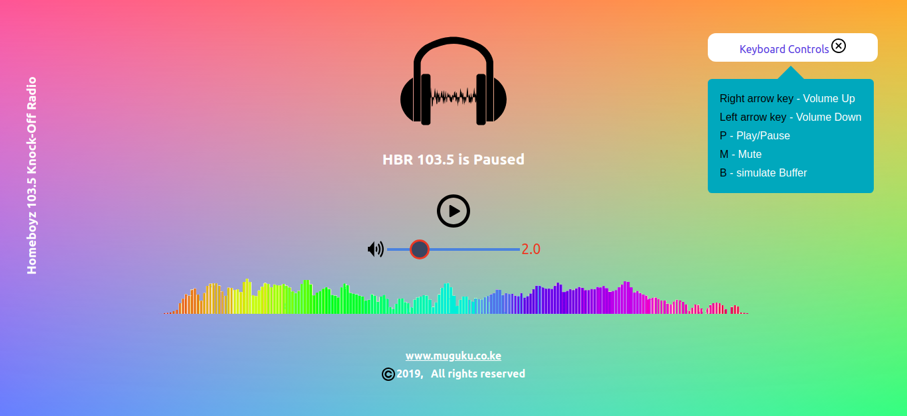
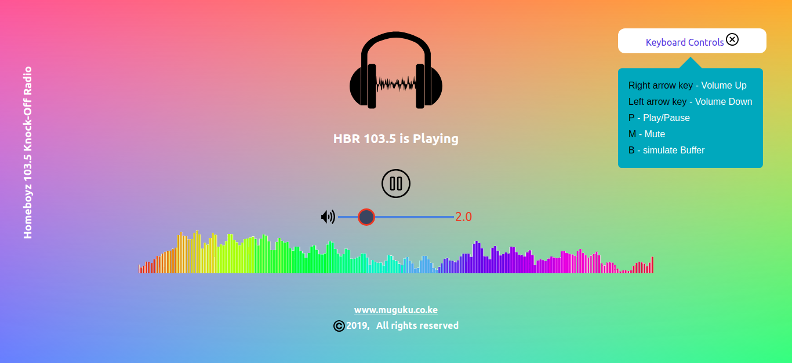
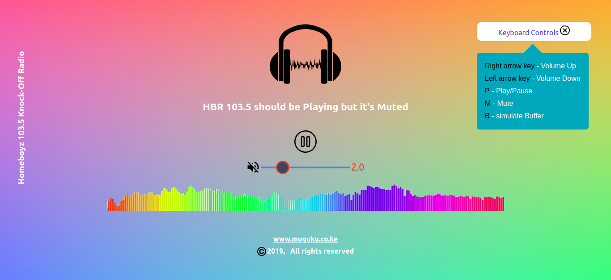
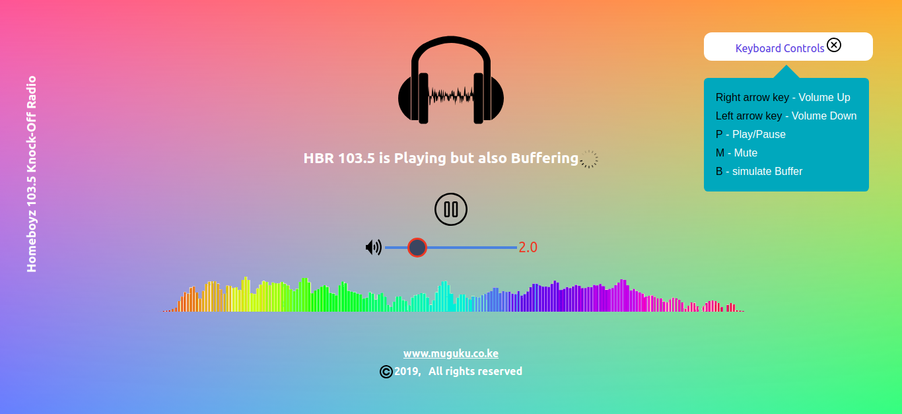

# ReactjS Online radio player for Homeboyz Radio (hbr 103.5)

A ReactjS Online radio station for my favorite Kenyan radio station Homeboyz Radio (hbr 103.5).

## Demo Site

[homeboyz.herokuapp.com](http://homeboyz.herokuapp.com).

## N/B

1. Web Audio Api doesn't play nice with mobile browsers.
2. That being said though, i optimized the site for mobile.
3. I tested it on chrome for android and it works.
4. You can control the site with the mouse or the keyboard

## The technology stack

Reactjs, Heroku Cli, Sass, Web Audio API and an npm module called React Player.

## Screenshots

1. Landing Page
   

2. HBR Playing
   

3. HBR Muted
   

4. HBR Buffering

## Contributing

Pull requests are welcome. For major changes, please open an issue first to discuss what you would like to change.

## License

[GNU - gpl-3.0](https://choosealicense.com/licenses/gpl-3.0/)